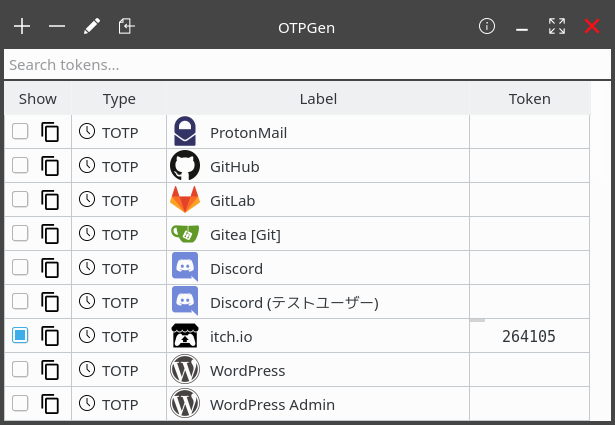
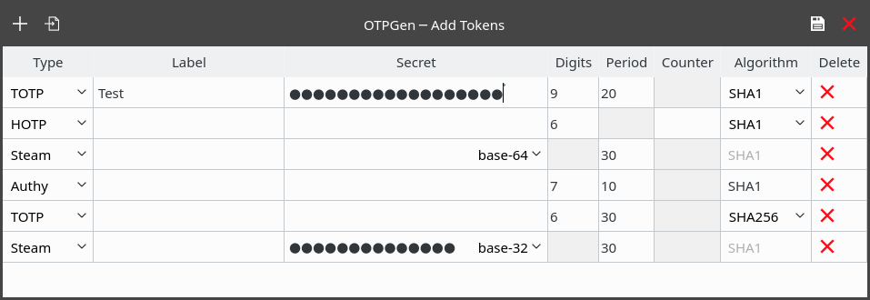

# OTPGen

Multi-purpose OTP token generator written in C++ and Qt with encryption and System Tray Icon.
Supports TOTP, HOTP, Authy and Steam and custom digit lengths and periods.

<br>

> This application is still in development, but already somewhat usable.

<br>

## Features

 - Can generate tokens for TOTP, HOTP, Authy and Steam
 - Supports custom digit lengths and periods <br>
   Non-standard OTPs may not use either 6 or 8 digits. Example: Authy (7 digits and 10 seconds)
 - System Tray Icon
 - [Qt Keychain](https://github.com/frankosterfeld/qtkeychain) Integration
   - KWallet, GNOME Keyring, OS X Keychain, Windows Credential Store
 - Clean interface
 - Import token secrets from other applications
   - andOTP (supports both: plaintext and encrypted backups)
   - Authy (supports both: xml and json input)
   - SteamGuard
 - Search your tokens with regular expressions in the search bar and never lose
   time because of a huge token database
 - Copy tokens to clipboard without revealing them in the UI
 - Copy tokens straight from the system tray menu without even opening the UI at all
 - Custom icons to better recognize your tokens


## Planned

 - Import
   - `otpauth:` uri
   - QR Code (file only)

 - Export
   - `otpauth:` uri
   - QR Code
   - andOTP

 - User Settings

<br>

## Requirements

 - Qt 5
 - Qt 5 D-Bus (only when using Qt Keychain with KWallet)
 - zlib
 - [libgcrypt](https://gnupg.org/software/libgcrypt/) (for the bundled OTP generation library written in C)
 - [libsecret](https://wiki.gnome.org/Projects/Libsecret) (for the bundled Qt Keychain library)
 - [crypto++](https://cryptopp.com/) (for the database encryption)


## Building the application

```sh
mkdir build && cd build
cmake -DCMAKE_BUILD_TYPE=Release ..
make
```

Make sure to build a **Release** build!! The Debug build uses a hardcoded test password
to avoid entering a password all the time during development. Never use real token secrets
during development.


## Tips

Looking for high quality SVG icons? Check out this amazing repository with over 1000 icons:

 - [gilbarbara/logos](https://github.com/gilbarbara/logos)


<br>

## Screenshots

> Screenshots may be out of date.




